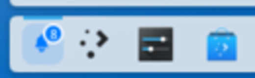
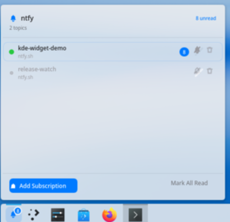
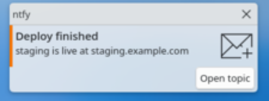

# ntfy Notifications for KDE Plasma

A Plasma 6 panel widget that subscribes to [ntfy](https://ntfy.sh) topics and raises a
desktop notification for every message.

- Subscribe to any ntfy server, not just ntfy.sh
- Add, mute and delete topics from a macOS-inspired popover
- Unread counts per topic and on the panel button
- Clicking a notification opens the topic in your browser

| | |
| --- | --- |
|  <br> Panel button, unread badge |  <br> Subscription popover |
|  <br> Desktop notification | |

## Installing

```sh
cmake -S . -B build -G Ninja -DCMAKE_BUILD_TYPE=Release
cmake --build build --target dev-install
```

`dev-install` puts the applet in `~/.local/share/plasma/plasmoids/org.ntfy.widget` and
the QML module in Qt's import directory. The second step needs `sudo`, because Qt only
looks for QML modules inside its own import path.

Restart the shell afterwards:

```sh
qdbus6 org.kde.plasmashell /MainApplication org.qtproject.Qt.QApplication.quit
```

Then add **ntfy Notifications** to a panel through *System Settings → Desktop Shell →
Widgets*.

To remove it again:

```sh
cmake --build build --target dev-uninstall
```

## Using it

Click the bell in the panel to open the popover.

| Action | How |
| --- | --- |
| Subscribe | **Add Subscription**, enter a server and a topic |
| Mute | The bell-slash button on a row |
| Delete | The bin button, twice within a few seconds |
| Clear unread | **Mark All Read**, or wait until new messages arrive |

Messages carry a priority. Priority 5 messages stay on screen for twenty seconds;
everything else uses the normal desktop timeout.

## Configuration

Subscriptions live in `$XDG_CONFIG_HOME/ntfy-kde-widget/subscriptions.json`:

```json
{
  "version": 1,
  "subscriptions": [
    {
      "id": "1a0f85ddc58-0",
      "server": "https://ntfy.sh",
      "topic": "alerts-team",
      "token": null,
      "enabled": true,
      "minPriority": 3,
      "createdAt": 1790831325
    }
  ]
}
```

- `server` — any ntfy instance; `https://` is added if you leave the scheme out.
- `token` — a `tk_…` access token for protected topics. The widget never sends one to
  the UI, it only uses it as a bearer token on the stream.
- `minPriority` — messages below this priority bump the unread counter but do not pop up.
- `createdAt` — messages older than this are treated as backlog: counted, never shown.

## Building and testing

```sh
cargo test --manifest-path rust/Cargo.toml
```

`ntfyprobe` is a small helper that reports how Plasma resolves the installed package,
which is handy when the widget fails to load:

```sh
./build/ntfyprobe org.ntfy.widget
```

More detail lives in [PLAN.md](PLAN.md) and [docs/architecture.md](docs/architecture.md).

## Licence

MIT. See [LICENSE](LICENSE).